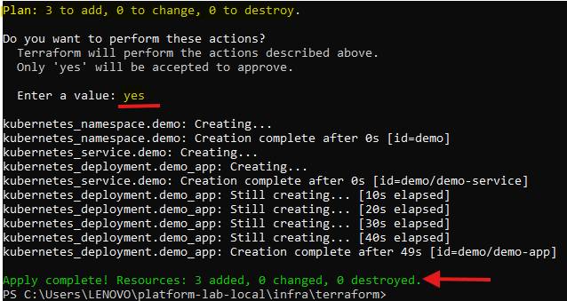

# Platform Lab Local

This project simulates a local environment to test infrastructure, GitOps workflows, microservices, security, and system resilience.

## Project Structure

- **infra/**: Infrastructure-as-code configuration.
- **gitops/**: Application and configuration management using GitOps.
- **services/**: Example microservices built with different technologies.
- **observability/**: Monitoring and distributed tracing tools.
- **security/**: Security policies, image scanning, and Software Bill of Materials (SBOM).
- **chaos/**: Chaos engineering simulations using tools like Litmus.
- **tools/**: Supporting tools (feature flagging, contract testing).

## Requirements

- Docker
- Kubernetes (Minikube, Kind, or Docker Desktop)
- Terraform
- ArgoCD or FluxCD
- Prometheus, Grafana, Tempo
- OPA, Trivy, Pact CLI

## Installation

1. Clone the repository:

```bash
git clone https://github.com/omaciasd/platform-lab-local.git
```

2. Navigate to the corresponding directories based on what you need to configure (infra, services).

## Usage

### 1. Deploy infrastructure with Terraform:

```bash
cd platform-lab-local/infra/terraform
terraform init
```


```bash
terraform apply
```



### 2. Deploy applications with ArgoCD:

```bash
kubectl apply -f ../../gitops/argo-cd/install.yaml
kubectl port-forward svc/argocd-server -n argocd 8080:80
```

Access ArgoCD at: http://localhost:8080
Default login:

Credentials: admin / from argocd-initial-admin-secret secret (use kubectl to retrieve it)

### 3. View Prometheus dashboards:

After Prometheus is running, access it at:
http://<prometheus-server-ip>:9090

### 4. View Prometheus dashboards:

After deploying Grafana, access it at:
http://<grafana-server-ip>:3000

Use the default login credentials:

- Credentials: admin

### 5. Run chaos tests:

```bash
kubectl apply -f ../../chaos/litmus-chaos/chaos_engine.yaml
```
